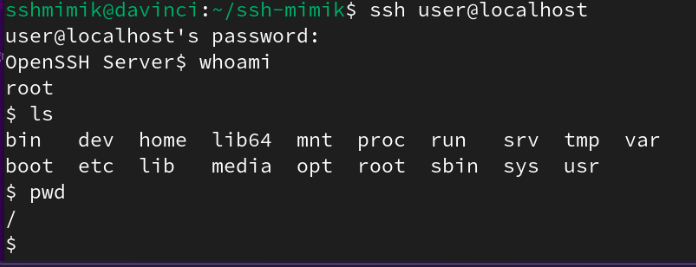

# Lab 1 - Initial Deployment
## Installation & Prerequisites
This initial lab setup will go through the various steps of installing the prerequisites for standing up the `sshmimik` honeypot and go through initial steps of logging in as well as some of the drawbacks of `sshmimik`.

Let's start off by cloning the repository:
`git clone https://github.com/redveil-security/ssh-mimik.git`
And installing the necessary requirements:
`sudo pip3 install -r requirements.txt`
* *Note: One thing to note when installing the requirements from the `requirements.txt` file is that they must be accessible to a user with sudo access because we'll be running the honeypot on port 22 which requires root access*

Now let's switch gears and install Docker. This is the heart of `sshmimik` since its primary function is to deploy ephemeral Docker containers upon successful SSH connections.
You can follow the [official Docker installation guide](https://docs.docker.com/engine/install/) for your particular operating system. For the sake of the guide, I'll be deploying it on a debian-based system & use `apt` to do so:

```
# Add Docker's official GPG key:
sudo apt-get update
sudo apt-get install ca-certificates curl
sudo install -m 0755 -d /etc/apt/keyrings
sudo curl -fsSL https://download.docker.com/linux/debian/gpg -o /etc/apt/keyrings/docker.asc
sudo chmod a+r /etc/apt/keyrings/docker.asc

# Add the repository to Apt sources:
echo \
  "deb [arch=$(dpkg --print-architecture) signed-by=/etc/apt/keyrings/docker.asc] https://download.docker.com/linux/debian \
  $(. /etc/os-release && echo "$VERSION_CODENAME") stable" | \
  sudo tee /etc/apt/sources.list.d/docker.list > /dev/null
sudo apt-get update

sudo apt-get install docker-ce docker-ce-cli containerd.io docker-buildx-plugin docker-compose-plugin
```

After it's installed, ensure that the Docker service is running: `sudo systemctl start docker` & `sudo systemctl status docker` to ensure it started properly.

*Note: If you skip these steps, `sshmimik` will not function properly upon SSH logins. It will error out each time you attempt to login to the honeypot with `shell request failed on channel 0`*

Now that we've got everything installed, let's run it! For now, we'll use it in its vanilla state and in the next lab, we'll customize its deployment using DockerFiles.

`sudo python3 serve.py -p <port> -l <where to store log files>`
`sudo python3 serve.py -p 22 -l .`
Successful running should result in the following:


After that, attempt to login to your instance using the credentials `user:password` and you should  get a shell after a while:




## Tasks
Now you've got `sshmimik` deployed, login to your honeypot and play around within the environment. Run a few commands and explore! Be sure to also analyze how the honeypot looks from the perspective of an attacker conducting reconnaissance.
*Please note, this project is still in early beta stages and there's still many things that must be implemented and improved. Feel free to take notes of anything you find lackluster and need improvement so I could improve `sshmimik` for future versions!*

