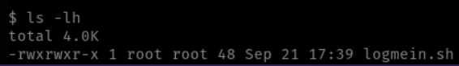

# Lab 2 - Deploying Custom Containers w/DockerFiles
If you've gotten `sshmimik` honeypot deployed and played around within the environment a bit, you'll have noticed that the environment that is deployed by default is very minimal and quite barebones. 

This *vanilla* environment that is deployed is quite obviously a honeypot as it has no personal characteristics and nothing of interest to keep an attacker busy. To solve this, `sshmimik` supports the usage of DockerFiles which is how we'll deploy those breadcrumbs we talked about earlier. 

When deploying `sshmimik`, we could use the `-d` flag & supply the path to the DockerFile that we want deployed. Here's an example DockerFile that we can use from the slides:
```Docker
FROM ubuntu:20.04

WORKDIR /opt/scripts

COPY ssh_login.sh /opt/scripts/logmein.sh

RUN chmod +x /opt/scripts/logmein.sh

WORKDIR /
```

This will copy a local file named `ssh_login.sh` to the remote honeypot directory `/opt/scripts` & rename it to `logmein.sh` & make it executable. Then it'll change the working directory to be `/` upon login.

The contents of `ssh_login.sh` for the sake of this demo is quite simple, it'll use an identity file to login to a remote host: 
```bash
#!/bin/bash
ssh -i "IDENTITY.pem" 192.168.2.1
```

As mentioned in the slides, the only pitfall of deploying files on the fly like this is that the file's modification date will be the exact date & time that the user logged into the honeypot, give or take a few seconds, since the container is built & deployed upon each SSH login:



In my opinion, this is a dead give away with deploying honeypots and will likely raise suspicions among careful adversaries. To alleviate this, we can simply add the following line to the DockerFile:
`RUN touch -a -m -t 201512180130.09 /opt/scripts/logmein.sh`

This will change the modification date to be `201512180130.09` which is December 18, 2025. Tweaking various configurations of the DockerFile that's used to deploy the SSH containers is a huge part of deploying a realistic, believable environment that'll help you gain intel on an adversaries' TTPs as well as keeping them busy within the fake environment.
## Tasks
Come up with a custom DockerFile that you can deploy using `sshmimik`, whether it be as simple as copying a custom Bash script to the honeypot or installing custom packages to give the attacker common Living off the Land (LOL) tools they can abuse to help you learn more about their TTPs.

